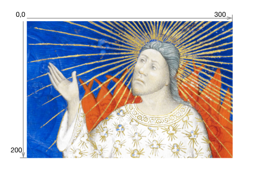
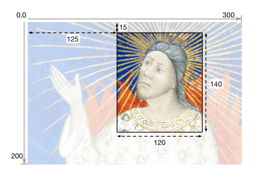
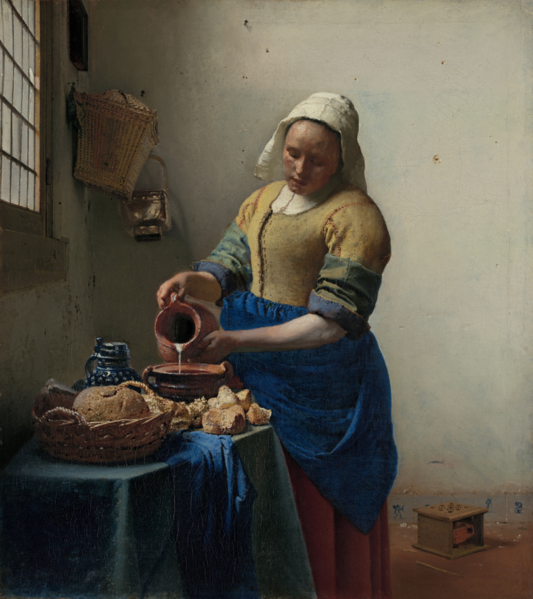

{alt='connect blocks'}


## What is IIIF?
There is a key need for accessing and interacting 
with multidimensional media over the web: 
allowing users to easily use/reuse multidimensional 
content by accessing 
it from its existing hosting site.

{alt='logo IIIF'}


The **International Image Interoperability Framework (IIIF)**
is a community of software, tools, content, people, and 
institutions solving image Interoperability challenges.

It provides a set of technical 
specifications built around shared 
challenges for accessing multidimensional media.

IIIF has the following goals[^1]:

- To give users an unprecedented level of 
uniform and rich access to media-based resources 
hosted around the world.
- To support interoperability between media repositories.
- To develop, cultivate and document shared technologies, 
such as image servers and web clients, that provide a 
world-class user experience in viewing, comparing, manipulating and annotating images.
  
[^1]: From [https://iiif.io/about/](https://iiif.io/about/)

The IIIF technical specifications are the glue that holds things together for image interoperability.

IIIF provides various core APIs:
 
- Image API (I want to get image pixels)
- Presentation API (I want to display the images)
- Content Search API
- Authentication API

This workshop will focus on the Image and Presentation APIs.


## Image API

The [Image API](https://iiif.io/api/image/2.1/) provides 
for a standardized way to request and deliver 
images. This can be for example:

- Give me the original image at full resolution.
- Give me the original image at low resolution.
- Give me a small section at the centre of the image.
- Give me an upside down tiled version of the image in gif format. 

The IIIF Image API allows for 
images to be served dynamically or from a 
static cache (implementation details).

Images are requested using URI templates that have the following syntax:

```
{scheme}://{server}{/prefix}/{identifier}/{region}/{size}/{rotation}/{quality}.{format}
``` 

Here is a quick example of how modifying these parameters 
can change the image that is delivered back to you.

For example, the image below is of dimensions 300 by 200 pixels.

{alt="full"}

The image API allows to retrieve an image containing
a region of the image. This requires 
using a URL which contains the region as defined by:

- *Top-left coordinates*: 125,15 which means 
125 in the x direction, and 15 in the y direction
- *Size of the box*: 120 in the x direction and 140 in the y direction.

{alt="region"}

It is also possible to define the size (e.g.90,), rotation and quality required.
All of this information can be expressed as:

```
region=125,15,120,140 size=90, rotation=0 quality=color

.../125,15,120,140/90,/0/color.jpg

# Source: https://iiif.io/api/image/3.0/
```

Options for quality include: default, color, gray and bitonal.

::::: challenge

## Trying the Image API

For the following image in an Image API Service:



[https://6fzwqjk2sg.execute-api.eu-west-2.amazonaws.com/latest/iiif/2/Johannes_Vermeer_Het_melkmeisje/](https://6fzwqjk2sg.execute-api.eu-west-2.amazonaws.com/latest/iiif/2/Johannes_Vermeer_Het_melkmeisje/)

Task 1: Write a URL on the browser that has the following parameters:

```
region=800,300,500,500

size=200,

rotation=90 

quality=color

```

Task 2: Write a URL on the browser that has the following parameters:
 

```
region=500,1000,400,300 

size=max 

rotation=0 

quality=gray

```

:::: solution

To create the url, you will need to combine the information 
according to the following url guidance:


```
{scheme}://{server}{/prefix}/{identifier}/{region}/{size}/{rotation}/{quality}.{format}
``` 

Using the following information:

- **scheme**: https
- **server**: 6fzwqjk2sg.execute-api.eu-west-2.amazonaws.com/
- **prefix**: latest/iiif/2/
- **identifier**: Johannes_Vermeer_Het_Melkmeisje/
- **region**: 800,300,500,500
- **size**: 200,
- **rotation**: 90
- **quality**: color
- **format**: .jpg

[https://6fzwqjk2sg.execute-api.eu-west-2.amazonaws.com/latest/iiif/2/Johannes_Vermeer_Het_melkmeisje/800,300,500,500/200,/90/color.jpg](https://6fzwqjk2sg.execute-api.eu-west-2.amazonaws.com/latest/iiif/2/Johannes_Vermeer_Het_melkmeisje/800,300,500,500/200,/90/color.jpg)

- **scheme**: https
- **server**: 6fzwqjk2sg.execute-api.eu-west-2.amazonaws.com/
- **prefix**: latest/iiif/2/
- **identifier**: Johannes_Vermeer_Het_Melkmeisje/
- **region**: 500,1000,400,300
- **size**: max
- **rotation**: 0
- **quality**: gray
- **format**: .jpg

[https://6fzwqjk2sg.execute-api.eu-west-2.amazonaws.com/latest/iiif/2/Johannes_Vermeer_Het_melkmeisje/500,1000,400,300/max/0/gray.jpg](https://6fzwqjk2sg.execute-api.eu-west-2.amazonaws.com/latest/iiif/2/Johannes_Vermeer_Het_melkmeisje/500,1000,400,300/max/0/gray.jpg)


:::::

:::::

## Presentation API

The [IIIF Presentation API](https://iiif.io/api/presentation/3.0/) 
is based on linked-data and
enables you to make accessible a *JSON file*,  which is a standard text-based 
format for representing structured data, known as the 
**IIIF Manifest**. 

The **IIIF Manifest** describes a **structured layout** 
for presenting the multidimensional
media and their metadata, including information such as:

- Labels
- Description
- License
- Attribution
- Link to the file


The **IIIF Manifest** can be read by a **IIIF Viewer** to present 
this multidimensional media. Existing Viewers include:

- Universal Viewer: [https://universalviewer.io/](https://universalviewer.io/)
- Mirador: [https://projectmirador.org/](https://projectmirador.org/)

See some [examples](https://uv-v4.netlify.app/) of **IIIF Manifests** for 
various IIIF Organisations, including amongst others:

- Wellcome Library
- V\&A
- British Library
- Bodleian


### IIIF Manifest Example

Various heritage institutions are making available IIIF manifest in 
from their collection web access pages.


For example: 

- [Getty](https://www.getty.edu/art/collection) provides access 
to **IIIF Manifest** when browsing items in their collection. See example: 
[https://www.getty.edu/art/collection/object/107DZP](https://www.getty.edu/art/collection/object/107DZP)
contains the [JSON code](https://media.getty.edu/iiif/manifest/0018c029-7963-4a4e-bc7e-401cf2aa9288) which 
is web-accessible.

Note that all of this metadata can be accessed and made available through the Viewer:

<iframe src="https://uv-v4.netlify.app/uv.html#?manifest=https://media.getty.edu/iiif/manifest/0018c029-7963-4a4e-bc7e-401cf2aa9288&c=0&m=0&cv=0&config=&locales=en-GB:English (GB),cy-GB:Cymraeg,fr-FR:Français (FR),pl-PL:Polski,sv-SE:Svenska&xywh=-1,-923,6299,5021&r=0"
allowfullscreen
  loading="lazy"
  width="100%"
  height="500px">
</iframe>
[&copy; J. Paul Getty Trust, licensed under CC BY 4.0.](https://uv-v4.netlify.app/uv.html#?manifest=https://media.getty.edu/iiif/manifest/0018c029-7963-4a4e-bc7e-401cf2aa9288&c=0&m=0&cv=0&config=&locales=en-GB:English%20(GB),cy-GB:Cymraeg,fr-FR:Fran%C3%A7ais%20(FR),pl-PL:Polski,sv-SE:Svenska&xywh=-1,-923,6299,5021&r=0)

Another example is the The University of Edinburgh Collections web-accessible [Mahabharata Scroll](https://collections.ed.ac.uk/mahabharata) which showcases
the advantages of the IIIF Presentation API for artefacts which are 
not easily accessible or can be handled


<iframe src="https://uv-v4.netlify.app/uv.html#?manifest=https://librarylabs.ed.ac.uk/iiif/manifest/mahabharataFinal.json#?c=0&m=0&s=0&cv=0&xywh=-37480%2C0%2C78774%2C49069"
allowfullscreen
  loading="lazy"
  width="100%"
  height="500px">
</iframe>
[&copy; Copyright The University of Edinburgh](https://uv-v4.netlify.app/uv.html#?manifest=https://librarylabs.ed.ac.uk/iiif/manifest/mahabharataFinal.json#?c=0&m=0&s=0&cv=0&xywh=-37480%2C0%2C78774%2C49069)


### IIIF Manifest Structure

See below an example of a IIIF Manifest written in JSON:

```JSON

{
  "@context": "http://iiif.io/api/presentation/3/context.json",
  "id": "https://iiif.io/api/cookbook/recipe/0001-mvm-image/manifest.json",
  "type": "Manifest",
  "label": {
    "en": [
      "Single Image Example"
    ]
  },
  "items": [
    {
      "id": "https://iiif.io/api/cookbook/recipe/0001-mvm-image/canvas/p1",
      "type": "Canvas",
      "height": 1800,
      "width": 1200,
      "items": [
        {
          "id": "https://iiif.io/api/cookbook/recipe/0001-mvm-image/page/p1/1",
          "type": "AnnotationPage",
          "items": [
            {
              "id": "https://iiif.io/api/cookbook/recipe/0001-mvm-image/annotation/p0001-image",
              "type": "Annotation",
              "motivation": "painting",
              "body": {
                "id": "http://iiif.io/api/presentation/2.1/example/fixtures/resources/page1-full.png",
                "type": "Image",
                "format": "image/png",
                "height": 1800,
                "width": 1200
              },
              "target": "https://iiif.io/api/cookbook/recipe/0001-mvm-image/canvas/p1"
            }
          ]
        }
      ]
    }
  ]
}
```
From: IIIF Cookbook recipes: https://iiif.io/api/cookbook/recipe/0001-mvm-image/

Note that it contains the following information:

- **Context**: Tells how to interpret the information. 
- **ID**: Unique identifier.
- **Type**: Whether it is a **Manifest** or other type of JSON file.
- **Label**: A human readable label, name or title for the resource. 
- **Canvas**: An individual page. 
This is the container where the multidimensional media is going to be drawn.
It has some properties such as width and height, as well as the items
which will be drawn on it.
- **Annotation Page** and **Annotation**: instructs to present the 
image as (part of) the Canvas. 
- **Target**: The Canvas where the media asset should be drawn.

The **IIIF Manifest** is not normally written by hand. Instead it can be done
using a script, or using a tool such as a Manifest Editor:

- Bodleian Libraries Manifest Editor: [https://digital.bodleian.ox.ac.uk/manifest-editor](https://digital.bodleian.ox.ac.uk/manifest-editor)
- Digirati Manifest Editor: [https://manifest-editor.digirati.services/](https://manifest-editor.digirati.services/)

## More Resources and References

- IIIF resources, see: [https://iiif.io/guides/finding_resources/](https://iiif.io/guides/finding_resources/).
- Information on how to put together a JSON file, see: [https://iiif.io/api/presentation/3.0/](https://iiif.io/api/presentation/3.0/)
- More information: [Everything you ever wanted to know about IIIF but were too afraid to ask](https://www.slideshare.net/Cogapp/everything-you-ever-wanted-to-know-about-iiif-but-were-too-afraid-to-ask).


Content adopted from [IIIF Training](https://training.iiif.io/) &copy IIIF under CC-BY-4.0 


## Tutorial

For this tutorial, there is a variety of code
for you to experiment bringing content to multidimensional media 
via an API or an Image framework onto a VR application.

The objective is to experiment with these APIs, reading a JSON file
or retrieving multimedia and deploying it in your application,
either at loading time (at the beginning of your application), or at runtime.

### Unity
Below is a script code in Unity which allows you to bring together images
from an image URL, such as:

[https://6fzwqjk2sg.execute-api.eu-west-2.amazonaws.com/latest/iiif/2/Johannes_Vermeer_Het_melkmeisje/](https://6fzwqjk2sg.execute-api.eu-west-2.amazonaws.com/latest/iiif/2/Johannes_Vermeer_Het_melkmeisje/)

``` C#
using System.Collections;
using System.Collections.Generic;
using UnityEngine;
using UnityEngine.Networking;
using System.Threading.Tasks;
using System;


public class callAPI : MonoBehaviour
{
    public string apiURL="";

    // Start is called before the first frame update
    async void Start()
    {

        if (apiURL=="") {
            Debug.Log("Nothing to see...");
        }
        else{ 
            //Task<string> data = GetStringData();
            //Debug.Log(data);
            Texture texture = await GetTextureData();


        } 
    }

    public async Task<Texture> GetTextureData()
    {
        TaskCompletionSource<Texture> taskCompletionSource = new TaskCompletionSource<Texture>();
        StartCoroutine(GetTextureDatafromURL(taskCompletionSource));
        try
        {
            Texture receiveddata = await taskCompletionSource.Task;
         
            if (receiveddata!=null)
            { 
                return receiveddata;
            }
            else
            {
                return null;
            }
        }
        catch (Exception e)
        {
            Debug.LogError("Error fetching data: " + e.Message);
            return null;
        }
    }


    private IEnumerator GetTextureDatafromURL(TaskCompletionSource<Texture> tcs)
    {


         using (UnityWebRequest uwr = UnityWebRequestTexture.GetTexture(apiURL))
        {
            yield return uwr.SendWebRequest();

            if (uwr.result != UnityWebRequest.Result.Success)
            {
                Debug.Log(uwr.error);
            }
            else
            {
                // Get downloaded asset bundle
                var texture = DownloadHandlerTexture.GetContent(uwr);
                Renderer renderer = GetComponent<Renderer>();                
                renderer.material.mainTexture = texture; 
            }
        }
        
    }
  
    
    public async Task<string> GetStringData()
    {
        TaskCompletionSource<String> taskCompletionSource = new TaskCompletionSource<String>();
        StartCoroutine(GetTextDatafromURL(taskCompletionSource));

        try
        {
            string receiveddata = await taskCompletionSource.Task;

            if (!string.IsNullOrEmpty(receiveddata))
            { 
                Debug.Log("Received Data: " + receiveddata);
                return receiveddata;
            }
            else
            {
                Debug.LogWarning("No data received.");
                return "";
            }
        }
        catch (Exception e)
        {
            Debug.LogError("Error fetching data: " + e.Message);
            return null;
        }
    }
     private IEnumerator GetTextDatafromURL(TaskCompletionSource<string> tcs)
    {
        using (UnityWebRequest request = UnityWebRequest.Get(this.apiURL))
        {
            yield return request.SendWebRequest();

            if (request.result == UnityWebRequest.Result.ConnectionError
                || request.result == UnityWebRequest.Result.ProtocolError)
            {
                Debug.LogError("Error: " + request.error);
                tcs.SetResult(string.Empty); // Set the result to an error or an appropriate default value
            }
            else
            {
                string data = request.downloadHandler.text;
                tcs.SetResult(data); // Set the result to the API response data
            }
        }
    }
    // Update is called once per frame
    void Update()
    {
        
    }
}

```
